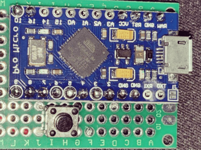
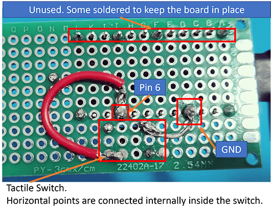

## Prerequisite

- Arduino Pro Micro (~ £7)
- Soldering iron, note that lead-free solder needs ~380℃.
- Blank PCB board (~ £2 each, cheaper if bought in bulk)
- Tactile Switches / Push buttons (~ £3 / bulk)
- Some wires.

## Solder

I'm not good at solder, and my aim is to get a bare working one for reference.
So here we are 🤣

Layout the board and tactile switch:

I have choosen to solder some of the pins on to the board then solder the extended pins to the board below.

💡 Might be better to solder directly with a deteached push button, this way we don't need the pin and the PCB board below.

In the back of the board, I'm soldering pin 6 and ground against the tactile switch, as well as some other pins soldered to prevent it moving:

